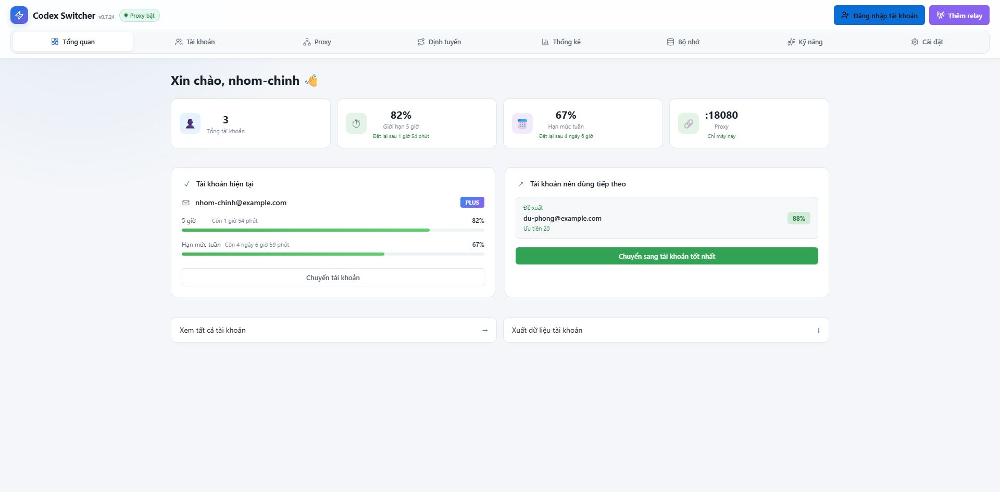
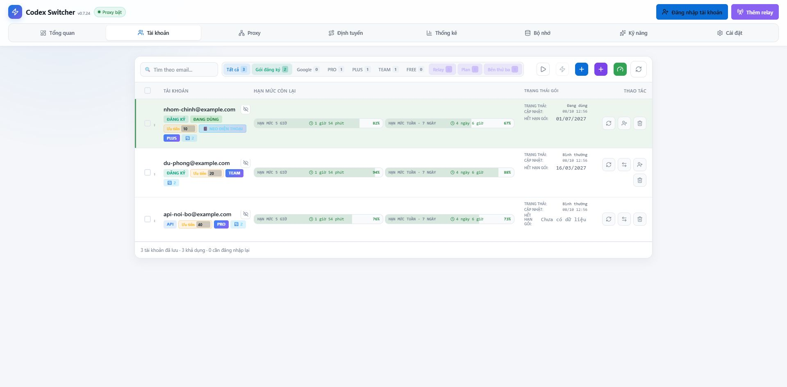
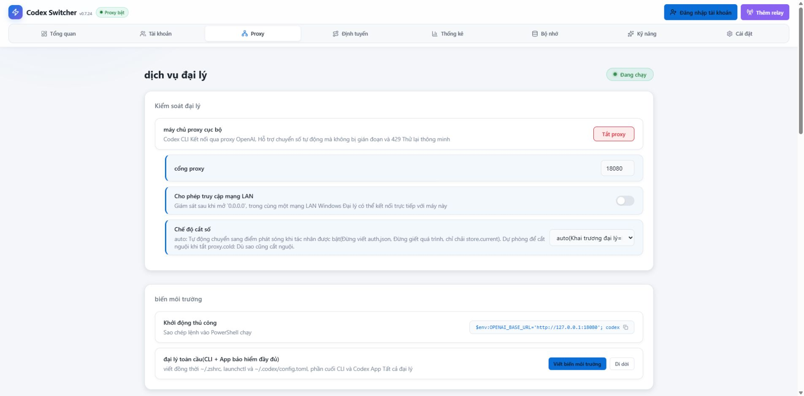
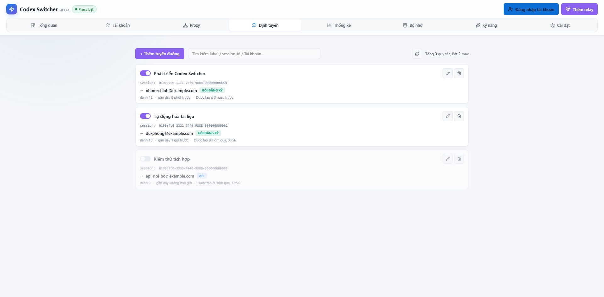
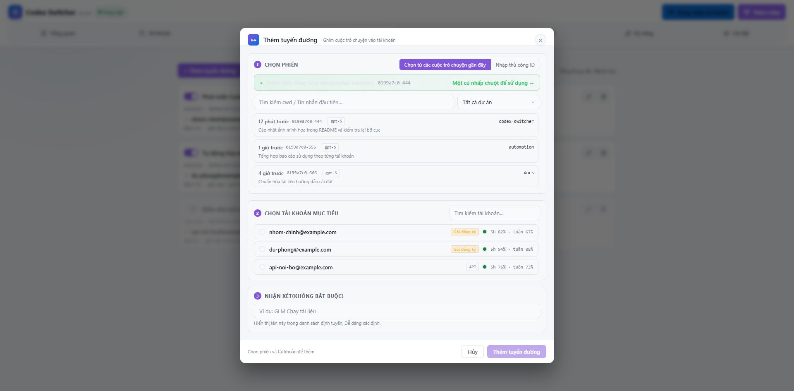
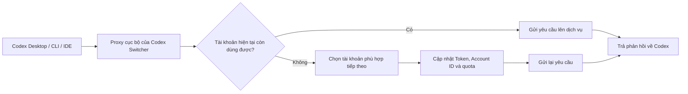

# Codex Switcher

[](https://github.com/TranDangKhoaAutomation/Source-Codex-Switcher/releases/latest)
[](https://github.com/TranDangKhoaAutomation/Source-Codex-Switcher/actions/workflows/release.yml)
[](LICENSE)
[](https://github.com/TranDangKhoaAutomation/Source-Codex-Switcher/releases/latest)

Codex Switcher là ứng dụng desktop quản lý nhiều tài khoản Codex, theo dõi quota và chuyển tài khoản tự động ngay tại tầng proxy. Mục tiêu của ứng dụng là giữ cho Codex CLI, Codex Desktop và các IDE tiếp tục làm việc khi tài khoản hiện tại hết quota, lỗi xác thực hoặc tạm thời không dùng được.

Ứng dụng hỗ trợ tài khoản ChatGPT OAuth, OpenAI API Key, Relay, Coding Plan và tài khoản từ máy chủ từ xa trong cùng một giao diện.

> Trạng thái hiện tại: phiên bản `0.7.23`.

## Điểm nổi bật

- Quản lý nhiều tài khoản ChatGPT OAuth, OpenAI API Key và Relay.
- Theo dõi riêng quota 5 giờ và quota tuần, kèm thời gian còn lại trước khi reset.
- Nhận biết đúng tài khoản chỉ có quota tuần, không gán nhầm thành quota 5 giờ.
- Tự lấy loại gói và ngày hết hạn gói khi API cung cấp dữ liệu.
- Proxy cục bộ cho HTTP, SSE và WebSocket.
- Tự chuyển tài khoản khi hết quota, gặp `401`, `429`, tài khoản bị chặn hoặc lỗi giới hạn trong luồng phản hồi.
- Có thể gửi lại yêu cầu sau khi chuyển tài khoản để hạn chế gián đoạn phía Codex.
- Không chuyển giá trị quota `0%` sang Codex Desktop; lớp bảo vệ giao diện dùng mức sàn `1%` trong khi Switcher vẫn xử lý trạng thái hết quota thật ở backend.
- Cập nhật quota theo đúng tài khoản mới ngay sau khi chuyển.
- Hỗ trợ thứ tự ưu tiên tuyệt đối: tài khoản có số ưu tiên nhỏ hơn được chọn trước khi còn dùng được.
- Hỗ trợ Relay theo giao thức Responses hoặc Chat Completions.
- Chuyển đổi `/v1/responses` sang `/chat/completions` cho các dịch vụ không hỗ trợ trực tiếp giao thức Codex.
- Hỗ trợ Session Routing, Phone Anchor, thống kê Token, cache và Skills.
- Có thể chạy nền và tự khởi động cùng hệ điều hành.
- Giao diện tiếng Việt, giữ nguyên các tên kỹ thuật như OAuth, Relay, GLM, API Key, WebSocket, Responses và Chat Completions.

## Đối chiếu với các tính năng gốc

Các tính năng dưới đây vẫn còn trong phiên bản hiện tại. Một số tính năng đã được mở rộng hoặc đổi tên so với giao diện cũ:

| Tính năng gốc | Vị trí hoặc tên hiện tại |
| --- | --- |
| Quản lý nhiều tài khoản | Trang `Tài khoản`, hỗ trợ OAuth, API Key, Relay và Google Antigravity |
| Ẩn thông tin tài khoản | Nút hình con mắt trên từng tài khoản; trạng thái được lưu qua lần khởi động sau |
| Chuyển nhanh tài khoản | Trang `Tài khoản`, `Tổng quan` và popup khay hệ thống |
| Theo dõi quota | Quota 5 giờ, quota tuần, Spark và Luna Reserve |
| Usage Stats | Trang `Thống kê` có token trọn đời, streak, hoạt động hằng ngày, top skill/plugin; trang `Bộ nhớ` giữ thống kê proxy cục bộ |
| Manual Reset Credits | Huy hiệu reset credit trong từng tài khoản, có danh sách ngày hết hạn và nút sử dụng |
| Automatic Warm-Up | `Tự kích hoạt chu kỳ`, chạy ngay từng tài khoản/toàn bộ, tự chạy sau reset hoặc theo các mốc giờ đã đặt |
| System Tray Controls | Popup khay hệ thống, menu chuột phải và ba chế độ: biểu tượng, chữ quota hoặc ẩn |
| macOS Dock Control | Chọn hiện trên Dock hoặc chỉ chạy ở thanh menu |
| Rate-Limit Monitoring | Theo dõi 5 giờ, tuần, Spark, Luna Reserve, thời điểm reset và ngày hết hạn gói |
| Blocked Switch Recovery | Chuyển nóng qua proxy, làm mới WebSocket và công cụ đóng tiến trình Codex khi cần |
| Dual Login Mode | OAuth chính thức, nhập `auth.json`, OTP, API Key và nhập hàng loạt |
| Chạy nền | Tự khởi động cùng Windows, thu nhỏ xuống khay và tiếp tục chạy proxy |
| Browser Dashboard | Chế độ máy chủ cung cấp `/dashboard`; dữ liệu và thao tác vẫn bắt buộc shared secret |

## Ảnh giao diện











## Cách hoạt động



Codex chỉ cần gửi yêu cầu đến proxy cục bộ. Việc chọn tài khoản, làm mới Token, phát hiện giới hạn, chuyển tài khoản và xử lý Relay do Codex Switcher đảm nhiệm.

Proxy mặc định hoạt động tại:

```text
http://127.0.0.1:18080/v1
```

Endpoint kiểm tra trạng thái:

```text
GET http://127.0.0.1:18080/health
```

## Quota và chuyển tài khoản

### Hai cửa sổ quota chính

Ứng dụng chỉ hiển thị hai cửa sổ chính của tài khoản Codex:

- `5 giờ`: phần trăm còn lại và thời gian đến lần reset tiếp theo.
- `Tuần`: phần trăm còn lại và thời gian đến lần reset tiếp theo.

Nếu API chỉ trả về cửa sổ 7 ngày, ứng dụng hiển thị đây là quota tuần và không tạo một thanh quota 5 giờ giả.

### Bảo vệ trạng thái 0%

Backend vẫn nhận biết chính xác tài khoản đã hết quota để chuyển tài khoản. Tuy nhiên, phản hồi quota gửi về Codex Desktop được bảo vệ để không trả về `0%`, vì một số phiên bản Codex Desktop có thể khóa ô nhập khi nhận trạng thái này.

Quy tắc:

- Quota thực tế lớn hơn `1%` được giữ nguyên.
- Quota thực tế bằng `0%` được biểu diễn cho Codex Desktop là `1%`.
- Switcher vẫn coi tài khoản đó là hết quota và chuyển sang tài khoản khác.
- Sau khi chuyển, quota gửi về Codex được lấy từ tài khoản mới.

### Thứ tự ưu tiên

Trong trang `Cài đặt`, tùy chọn **Chuyển theo thứ tự ưu tiên tuyệt đối** được bật mặc định.

Khi bật:

1. Loại bỏ tài khoản đã hết quota hoặc không dùng được.
2. Chọn tài khoản còn dùng được có số ưu tiên nhỏ nhất.
3. Chỉ dùng quota, loại gói và các tiêu chí khác để phân hạng giữa các tài khoản cùng mức ưu tiên.

Ví dụ: tài khoản ưu tiên `2` đã hết quota, tài khoản ưu tiên `1` sẵn sàng và tài khoản ưu tiên `4` còn nhiều quota hơn. Switcher vẫn chọn tài khoản ưu tiên `1`.

Khi tắt tùy chọn này, Switcher dùng chế độ thông minh, trong đó lượng quota và loại gói có thể được xếp cao hơn số ưu tiên.

Tùy chọn **Tự quay lại tài khoản ưu tiên cao** cho phép Switcher trở về tài khoản ưu tiên nhỏ hơn khi quota của tài khoản đó đã phục hồi đến ngưỡng cấu hình.

### Spark và Luna Reserve

Ngoài hai quota chính, Switcher còn đọc các cửa sổ độc lập khi tài khoản được OpenAI cấp:

- `Spark`: quota riêng của dòng model GPT Codex Spark, gồm cửa sổ ngắn hạn và cửa sổ tuần.
- `Luna Reserve`: quota dự phòng riêng cho model Luna được hỗ trợ.

Các quota này không bị gộp vào thanh 5 giờ hoặc quota tuần thông thường. Khi model đang dùng có quota dự phòng hợp lệ, Switcher không chuyển tài khoản chỉ vì quota chính đã hết.

### Reset credit chủ động

Với tài khoản có reset credit, ứng dụng hiển thị huy hiệu `🔄 N` cạnh loại gói.

- Nhấn vào huy hiệu để xem từng credit và ngày hết hạn.
- Danh sách được sắp theo thời điểm hết hạn gần nhất.
- Credit sắp hết hạn được cảnh báo bằng màu.
- Chỉ khi xác nhận, ứng dụng mới gửi yêu cầu sử dụng một credit.
- Sau khi sử dụng, quota và số credit được tải lại.

Reset credit là tài nguyên thật của tài khoản. Thao tác thành công không thể hoàn tác.

### Giữ chu kỳ quota

Giữ chu kỳ quota là phiên bản mở rộng của tính năng Automatic Warm-Up trong ứng dụng gốc. Switcher gửi một yêu cầu Codex tối thiểu để bắt đầu cửa sổ quota mới đúng lúc cần thiết.

Quy tắc hiện tại:

- Nhận dạng cửa sổ theo thời lượng API trả về, không suy đoán từ tên gói.
- `18000` giây được hiểu là cửa sổ 5 giờ.
- `604800` giây được hiểu là cửa sổ 7 ngày.
- Tài khoản chỉ có quota tuần sẽ dùng chế độ giữ chu kỳ tuần.
- Mỗi sự kiện reset chỉ được thử một lần để tránh tiêu hao Token lặp lại.
- Trạng thái đã thử được lưu trước khi gửi yêu cầu, nên lỗi mạng hoặc timeout không gây gửi trùng.
- Trong chế độ máy khách, máy chủ là nơi duy nhất thực hiện giữ chu kỳ để tránh hai máy cùng gửi.

Có thể bật hoặc tắt riêng tính năng này trên từng tài khoản.

### Ngày hết hạn tài khoản và gói

Switcher ưu tiên lấy ngày hết hạn gói từ metadata của tài khoản hoặc claim OAuth. Nếu nhà cung cấp không trả dữ liệu, người dùng có thể nhập ngày hết hạn thủ công để quản lý tài khoản ngắn hạn.

Ngày hết hạn gói được lưu riêng với thời điểm hết hạn Access Token; hai giá trị này không được dùng thay thế cho nhau.

## Các trang trong ứng dụng

| Trang | Chức năng |
| --- | --- |
| Tổng quan | Tài khoản hiện tại, quota, đề xuất tài khoản và thao tác nhanh |
| Tài khoản | Danh sách tài khoản, mức ưu tiên, loại gói, quota và trạng thái |
| Proxy | Trạng thái proxy, cổng, LAN, bộ đếm yêu cầu và tự chuyển tài khoản |
| Định tuyến | Gắn một phiên Codex cụ thể với một tài khoản hoặc Relay |
| Thống kê | Token, chi phí, lịch sử chuyển tài khoản và phân bố model |
| Bộ nhớ | Session affinity, prompt cache và mức tiết kiệm cache |
| Kỹ năng | Quản lý Skills giữa Codex và các công cụ tương thích |
| Cài đặt | Khởi động cùng máy, chạy nền, ưu tiên, giao diện và chế độ từ xa |

## Quản lý tài khoản

Codex Switcher hỗ trợ:

- Đăng nhập OpenAI bằng OAuth chính thức.
- Nhập từ `auth.json` hiện có.
- Nhập nhiều tài khoản từ tệp.
- Đăng nhập OTP theo danh sách email.
- Thêm OpenAI API Key.
- Thêm Relay hoặc Coding Plan.
- Xuất và nhập dữ liệu tài khoản.
- Đổi tên, vô hiệu hóa, xóa hoặc đăng nhập lại tài khoản.
- Đặt số ưu tiên riêng cho từng tài khoản.
- Tự làm mới Access Token khi Refresh Token còn hợp lệ.

### Lời mời và referral

Với tài khoản đủ điều kiện, ứng dụng có thể gửi lời mời Codex từ ngay trong danh sách tài khoản:

- Nhập một hoặc nhiều email nhận lời mời.
- Hiển thị kết quả riêng cho từng địa chỉ.
- Không tự gửi lại một yêu cầu POST khi kết quả chưa rõ, tránh tạo lời mời trùng.
- Phân biệt referral với reset credit; đây là hai loại tài nguyên khác nhau.

### Google Antigravity

Google Antigravity là một loại tài khoản độc lập với tài khoản OpenAI hiện tại:

- Đăng nhập bằng Google OAuth.
- Tự phát hiện project và danh sách model được cấp.
- Hiển thị quota theo từng model Gemini hoặc Claude.
- Làm mới Token và quota theo luồng riêng.
- Chuyển đổi yêu cầu Responses sang định dạng Google tương ứng.
- Hỗ trợ tool call và luồng SSE.
- Có tài khoản hiện tại riêng, không ghi đè `~/.codex/auth.json` của OpenAI.

## Relay và Coding Plan

Hai kiểu giao thức được hỗ trợ:

- `responses`: chuyển tiếp trực tiếp `/v1/responses`.
- `chat_completions`: chuyển đổi yêu cầu Codex sang `/chat/completions`, sau đó chuyển luồng phản hồi ngược lại thành định dạng Responses.

Một số preset có sẵn:

| Dịch vụ | Giao thức | Trạng thái |
| --- | --- | --- |
| OpenAI-compatible Responses Relay | Responses | Hỗ trợ |
| GLM Coding Plan | Chat Completions | Đã kiểm thử |
| Xiaomi MiMo Token Plan | Chat Completions | Đã kiểm thử |
| DeepSeek | Chat Completions | Đã kiểm thử |
| Moonshot Kimi | Chat Completions | Có preset |
| MiniMax | Chat Completions | Có preset |
| DashScope / Qwen | Chat Completions | Có preset |
| Volcano Ark / Doubao | Chat Completions | Có preset |
| Tencent Hunyuan | Chat Completions | Có preset |
| Baidu Qianfan / ERNIE | Chat Completions | Có preset |
| UCloud Modelverse | Chat Completions | Có preset |
| OpenRouter | Chat Completions | Có preset |
| Ollama | Chat Completions | Có preset |
| Dịch vụ tùy chỉnh | Tùy chọn | Hỗ trợ |

Tên model, tên nhà cung cấp và thuật ngữ giao thức được giữ nguyên để tránh gây nhầm lẫn khi cấu hình.

## Session Routing

Session Routing cho phép gắn một phiên Codex với một tài khoản hoặc Relay cụ thể.

- Quy tắc có hiệu lực ngay, không cần khởi động lại Codex.
- Có thể chọn phiên đang hoạt động từ giao diện.
- Phù hợp khi muốn một dự án dùng GLM nhưng dự án khác tiếp tục dùng tài khoản ChatGPT.
- Giúp giữ prompt cache ổn định theo từng phiên.

Dữ liệu được lưu tại:

```text
~/.codex-switcher/session_routes.json
```

## Phone Anchor

Phone Anchor giữ danh tính trong `~/.codex/auth.json` cố định cho Codex Desktop hoặc kết nối điện thoại, trong khi proxy vẫn có thể chuyển tài khoản đầu ra cho CLI và IDE.

Chỉ nên đặt Phone Anchor trên tài khoản ChatGPT OAuth. Relay và API Key không có `chatgpt_account_id` phù hợp cho chức năng này.

## Chat Completions bridge

Các ứng dụng tương thích OpenAI có thể dùng ChatGPT subscription thông qua endpoint:

```text
POST http://127.0.0.1:18080/v1/chat/completions
```

Switcher chuyển yêu cầu Chat Completions sang Responses, dùng tài khoản được chọn và chuyển kết quả về định dạng Chat Completions. Function calling và luồng SSE được hỗ trợ.

## Thống kê, lịch sử và cache

Trang `Thống kê` tổng hợp:

- Input Token, Output Token và Cached Token.
- Chi phí ước tính theo model.
- Số yêu cầu và số lần chuyển tài khoản.
- Lý do chuyển: quota, `401`, `429`, lỗi trong luồng, WebSocket hoặc thao tác thủ công.
- Lịch sử quota theo chu kỳ.
- Ước tính dung lượng gói từ thay đổi quota và Token thực tế.
- Phân bố model và hoạt động theo thời gian.

Trang `Bộ nhớ` cung cấp:

- Session affinity giữa phiên và tài khoản.
- Prompt cache key riêng theo tài khoản.
- Cached input Token và mức tiết kiệm cache.
- Lịch sử yêu cầu gần đây.

## Chế độ máy chủ và máy khách

Switcher hỗ trợ dùng chung trạng thái giữa nhiều máy:

- `off`: máy hiện tại hoạt động độc lập.
- `server`: máy hiện tại giữ tài khoản, Token và API điều khiển trung tâm.
- `client`: máy hiện tại lấy tài khoản, quota và Token lease từ máy chủ.
- `solo`: máy hiện tại tự quản lý tài khoản nhưng vẫn đồng bộ dữ liệu cần thiết với máy chủ.

Có thể cấu hình địa chỉ chính, địa chỉ dự phòng, cổng và shared secret. Chế độ này phù hợp khi một máy chạy proxy liên tục còn máy khác chỉ dùng giao diện hoặc IDE.

## Quản lý Skills

Trang `Kỹ năng` hỗ trợ:

- Quét Skills đã có trên máy.
- Thêm nguồn từ GitHub hoặc thư mục cục bộ.
- Cài đặt và gỡ Skills.
- Xem nội dung Skill trước khi sử dụng.
- Đồng bộ Skills giữa máy chủ và máy khách.
- Tạo liên kết dùng chung cho Codex, Claude, Gemini, OpenCode, Grok, Kimi và Antigravity khi công cụ tương ứng có mặt.
- Thiết lập danh sách không đồng bộ cho các Skill chỉ dùng trên một máy.

## Khay hệ thống và tích hợp IDE

Khi đóng cửa sổ nhưng vẫn bật chạy nền, ứng dụng tiếp tục giữ proxy hoạt động trong khay hệ thống.

Popup khay hệ thống cho phép:

- Xem tài khoản hiện tại và quota.
- Xem trạng thái proxy.
- Chuyển nhanh sang tài khoản tiếp theo.
- Làm mới dữ liệu.
- Mở cửa sổ chính hoặc thoát ứng dụng.

Ứng dụng hỗ trợ quy trình reload hoặc khởi động lại Windsurf, Antigravity, Cursor, VS Code và Codex App sau khi chuyển tài khoản. Công cụ khôi phục chuyển tài khoản có thể đóng tiến trình Codex đang giữ tệp hoặc phiên cũ trước khi thử lại.

## Khởi động cùng hệ điều hành

Trong trang `Cài đặt` có thể chọn:

- Không tự khởi động.
- Tự khởi động và mở cửa sổ.
- Tự khởi động ở chế độ nền.

Trên Windows, lệnh chạy nền có dạng:

```text
"C:\Program Files\Codex Switcher\codex-switcher.exe" --background
```

Đường dẫn thực tế phụ thuộc vị trí cài đặt.

Khi chạy nền, proxy và tự chuyển tài khoản vẫn hoạt động; không cần giữ cửa sổ chính mở.

## Cài đặt

Tải phiên bản mới nhất tại [GitHub Releases](https://github.com/TranDangKhoaAutomation/Source-Codex-Switcher/releases/latest).

### Windows

- Ưu tiên tệp `x64-setup.exe`.
- Có thể dùng `x64_en-US.msi` khi cần triển khai bằng MSI.

### macOS

- Apple Silicon: dùng bản `aarch64.dmg`.
- Intel: dùng bản `x64.dmg`.
- Nếu không chắc kiến trúc: dùng bản `universal.dmg`.

Nếu macOS báo ứng dụng bị hỏng do chưa notarize, có thể bỏ cờ quarantine:

```bash
sudo xattr -dr com.apple.quarantine "/Applications/Codex Switcher.app"
open "/Applications/Codex Switcher.app"
```

### Linux

Chọn một trong các định dạng `.deb`, `.rpm` hoặc `.AppImage` phù hợp với hệ thống.

## Chạy từ mã nguồn

Yêu cầu:

- Node.js 20 trở lên.
- Rust stable.
- Các thư viện hệ thống mà Tauri 2 yêu cầu.

Cài dependency:

```bash
npm install
```

Chạy chế độ phát triển:

```bash
npm run tauri dev
```

Chỉ chạy frontend:

```bash
npm run dev
```

Kiểm tra frontend:

```bash
npm run build
```

Chạy test Rust:

```bash
cargo test --manifest-path src-tauri/Cargo.toml
```

Build bản release:

```bash
npm run tauri build
```

Tệp đầu ra nằm trong:

```text
src-tauri/target/release/bundle/
```

## Phát hành bằng GitHub Actions

Workflow release chạy khi:

- Push tag có dạng `v*`.
- Chạy thủ công bằng `workflow_dispatch`.

Ma trận build gồm Windows, Linux, macOS Intel, macOS Apple Silicon và macOS Universal. Sau khi build thành công, các gói cài đặt được đưa vào GitHub Release tương ứng.

## Dữ liệu và bảo mật

Các vị trí dữ liệu thường dùng:

```text
~/.codex/auth.json
~/.codex-switcher/accounts.json
~/.codex-switcher/proxy.log
~/.codex-switcher/session_routes.json
```

Lưu ý:

- Không commit `auth.json`, Access Token, Refresh Token, API Key hoặc tệp xuất tài khoản lên Git.
- Dùng shared secret mạnh khi bật chế độ máy chủ từ xa.
- Chỉ bật truy cập proxy qua LAN khi tin cậy mạng nội bộ.
- Sao lưu dữ liệu tài khoản trước khi xóa hoặc nhập đè.
- Refresh Token có thể bị thay thế sau khi làm mới; Switcher lưu lại Token mới trước khi chuyển tài khoản.

## Kiểm tra nhanh

Kiểm tra proxy:

```powershell
Invoke-RestMethod http://127.0.0.1:18080/health
```

Kết quả hợp lệ có trường:

```json
{
  "status": "ok"
}
```

Kiểm tra build frontend:

```bash
npm run build
```

Kiểm tra các test liên quan đến ưu tiên và quota:

```bash
cargo test --manifest-path src-tauri/Cargo.toml --lib priority_
cargo test --manifest-path src-tauri/Cargo.toml --lib desktop_quota_protection
```

## Công nghệ sử dụng

- React và TypeScript.
- Vite.
- Tauri 2.
- Rust, Tokio, Hyper và Reqwest.
- Lưu trữ JSON cục bộ, không cần SQLite.
- GitHub Actions cho build đa nền tảng.

## Đóng góp

Khi gửi thay đổi:

1. Không đưa Token hoặc dữ liệu tài khoản thật vào fixture.
2. Chạy `npm run build`.
3. Chạy test Rust liên quan.
4. Nếu sửa `proxy.rs`, phải khởi động lại ứng dụng trước khi kiểm thử thực tế.
5. Mô tả rõ provider, giao thức, model và loại lỗi đã gặp.

## Nguồn và giấy phép

Dự án được phát triển từ mã nguồn Codex Switcher và tiếp tục được tùy chỉnh cho quy trình sử dụng nhiều tài khoản, proxy cục bộ và giao diện tiếng Việt.

**Bản quyền phần phát triển và tùy chỉnh © 2026 Trần Đăng Khoa.** Phần mã nguồn gốc vẫn được ghi công theo nội dung trong tệp giấy phép.

Phát hành theo giấy phép MIT. Xem [LICENSE](LICENSE).
